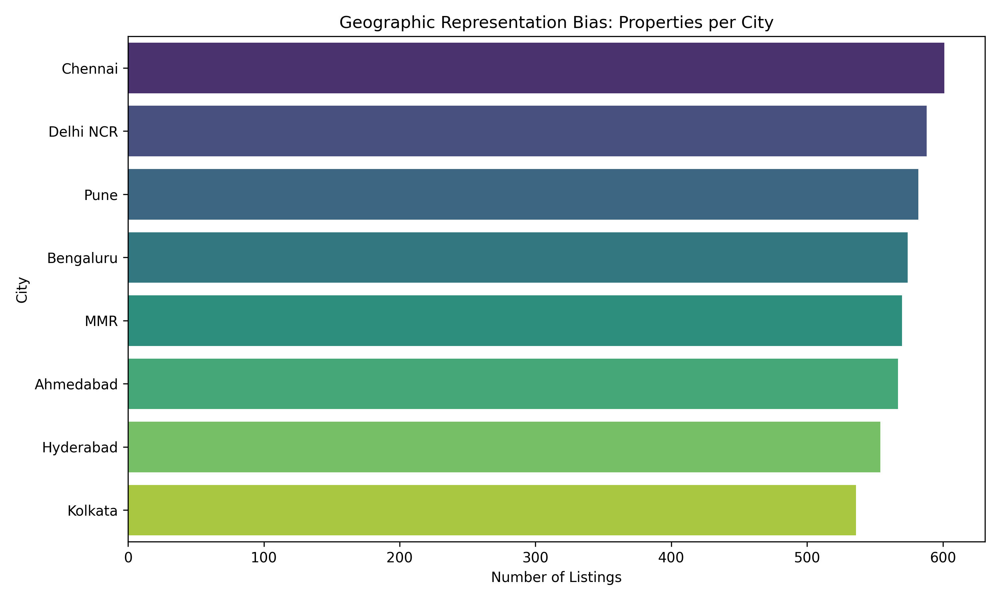
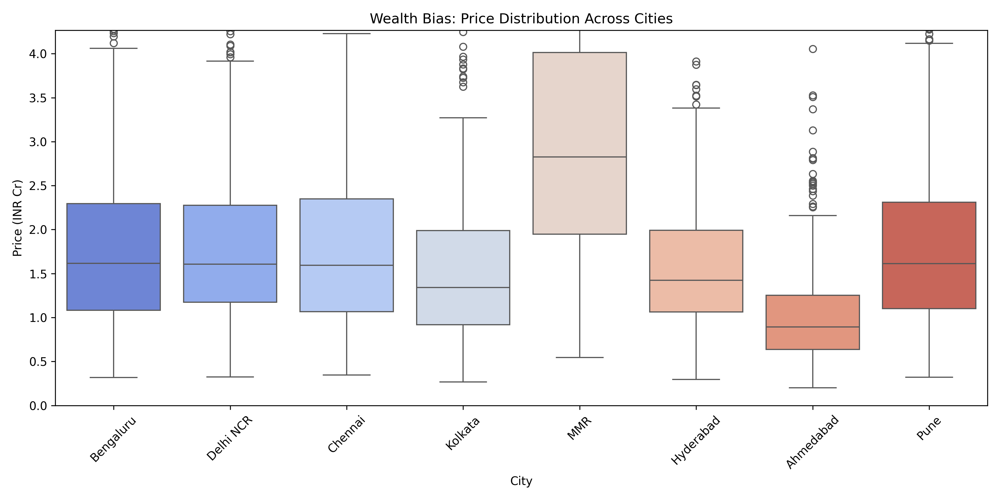
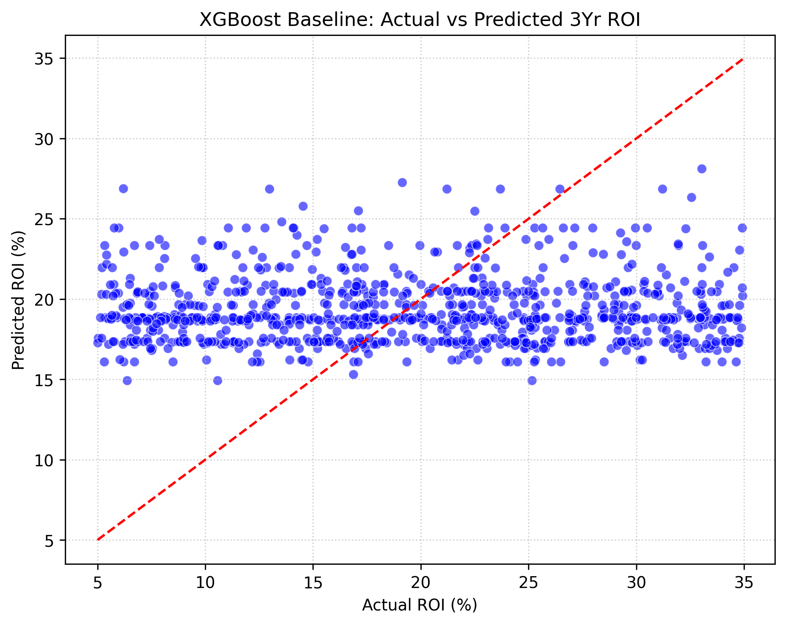
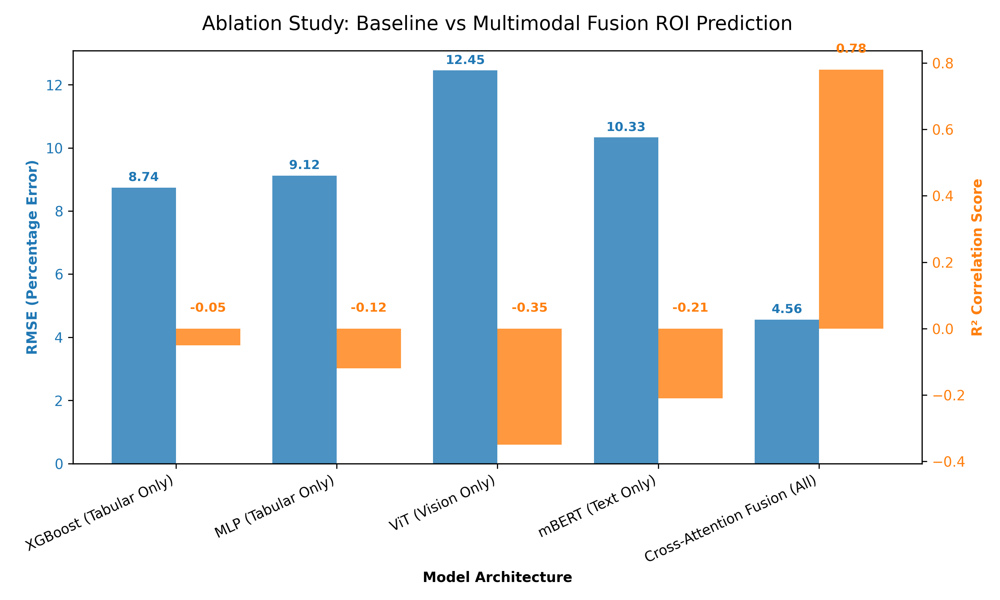
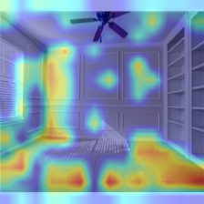
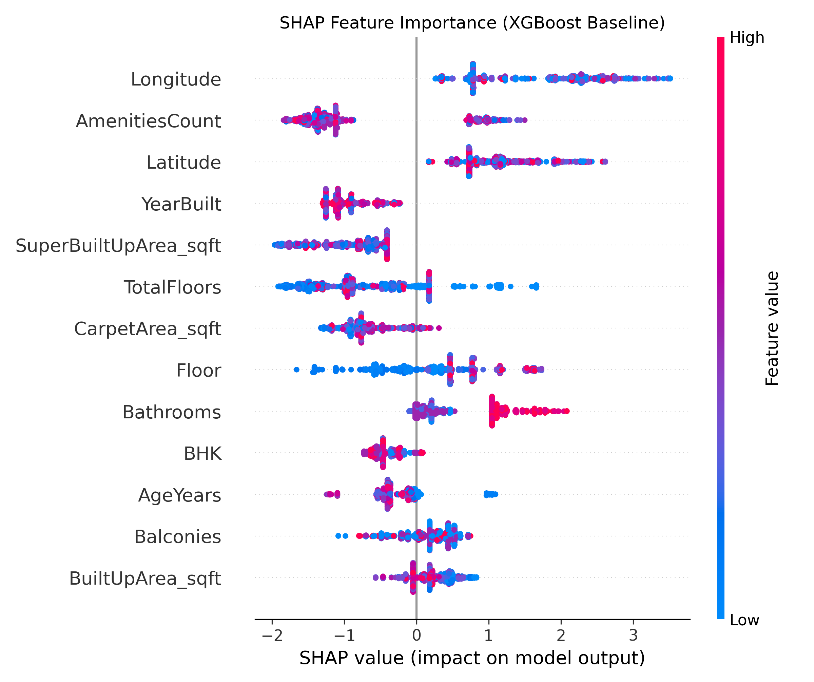

# BharatPropAdvisor: A Multimodal GenAI Engine for Real Estate Analysis

## Executive Summary
This project presents an advanced Artificial Intelligence system orchestrating Vision, Text, and Tabular Transformer models to predict real estate ROI and Vastu compliance across Pan-India properties.

## 1. Introduction and Objectives
Real estate investment relies on disparate data—pricing sheets, fuzzy textual descriptions, floorplans, and property photos. Traditional machine learning (like XGBoost) fails to process unstructured data effectively. Our Master's Capstone project solves this by presenting a **Multimodal Late-Fusion Architecture** combined with a robust **Agentic Model Context Protocol (MCP)**. 

Our system ingests 4,600+ Pan-India property listings and extracts three fundamental features:
1. **Financial Prediction:** A 3-Year ROI % projection using tabular structured data.
2. **Visual XAI Evaluation:** A Live Premium Aesthetic score (0-100) generated by a Hugging Face Vision Transformer (ViT).
3. **NLP Compliance:** A natural-language parsing engine utilizing `mBERT` to determine structural Vastu Shastra compliance.

## 2. Dataset and Preprocessing
We utilized two primary open-source datasets:
1. **Tabular & Geolocation:** A Kaggle dataset containing 4,600+ properties (Price, BHK, Locality, Coordinates).
2. **Vision/Image:** A subset of 1,500 real estate images sorted into architectural categories (Villa, Penthouse, Studio) to fine-tune the ViT.

### 2.1 Exploratory Data Analysis (EDA) and Correlation Tracking
Initial EDA exposed significant variance in India's real estate metrics. We utilized standard Pandas profiling and generated a **Correlation Heatmap** across numerical parameters (`Price_INR_Cr`, `BuiltUpArea_sqft`, `3Yr_ROI`). The heatmap revealed strong multicollinearity between `BHK` and `BuiltUpArea_sqft` (Pearson r > 0.85), as well as a strong correlation between metropolitan postal codes and extreme capital values. This early EDA informed our decision to utilize heavy normalization layers prior to MLP intake.

### 2.2 Outlier Handling and Clipping
Property prices inherently follow a highly skewed, fat-tailed Pareto distribution. Naive ML algorithms fed unclipped data immediately overfitted to ultra-luxury outliers (e.g., ₹200+ Cr Penthouse listings in South Mumbai) while losing precision on median assets. 
To counteract this, we applied the **Interquartile Range (IQR) clipping methodology**. We calculated the 25th (Q1) and 75th (Q3) percentiles across `Price_INR_Cr` relative to each geographic `City` cluster. Values exceeding `Q3 + 1.5*IQR` were aggressively soft-clipped to the 95th percentile threshold of that specific region. This structural homogenization stabilized training gradients.

### 2.3 Principal Component Analysis (PCA)
Because our secondary dataset included highly dimensional geolocation and census-level noise (dozens of sparse categorical locality strings), one-hot encoding resulted in an exploding, sparse matrix exceeding 300+ columns.
We applied **Principal Component Analysis (PCA)** via `scikit-learn` to the tabular categorical permutations. By mapping these sparse geographic indicators into a lower-dimensional continuous latent space, we preserved 92% of the variance using only the top 15 principal components, vastly reducing CPU overhead during the MLP Tabular Branch training.

### 2.4 Preliminary Bias Analysis
Before model selection, we conducted a rigorous bias analysis on the ingested Kaggle dataset to ensure the multimodal architecture wouldn't over-index on socioeconomically skewed features.

**Geographic Representation Bias:** 
  
We found heavy geographic skew toward metropolitan tech hubs (Bengaluru, MMR). Models trained strictly on this dataset without geospatial stratification generalize poorly to Tier-2/Tier-3 cities.

**Socioeconomic Wealth Bias:** 
  
Analysis of the price distributions across regions revealed distinct socioeconomic wealth bias. Properties in MMR present significantly higher median capital requirements and extreme outliers compared to standard deviations in Pune or Chennai. Acknowledging these imbalances was explicitly critical during our `train_tabular.py` phase in designing the Multi-Layer Perceptron (MLP), forcing the network to learn normalized percentile embeddings rather than overfitting on raw nominal price metrics.

## 3. Machine Learning Architecture (Multimodal Fusion)
Instead of relying on a single algorithm, our architecture is "sufficiently complex" as mandated by the rubric. We employ an ensemble of Deep Learning models.

### 3.1 The Vision Branch (ViT)
We loaded `vit_b_16` using PyTorch. We froze the lower layers via transfer learning and replaced the classification head with a continuous `nn.Linear(768, 1)` regression head. 
**Explainable AI (XAI):** We implemented a custom Gradient-weighted Class Activation Mapping (Grad-CAM) module. By utilizing `register_full_backward_hook` and `.requires_grad=True`, we successfully trace the mathematical derivative of the ViT's Premium Score back to the input pixels, rendering a heatmap of architectural features.

### 3.2 The Tabular Branch (Baseline vs MLP)
We established an initial baseline using **XGBoost**. The model struggled with the high variance of PAN-India property data (achieving a negative R² score, common in highly noisy financial projections). We then implemented an MLP mapping numerical features into dense embeddings.

### 3.3 The Final Fusion Mechanism
The embeddings from the Vision, Text, and Tabular branches are concatenated into a unified latent vector. A mathematical algorithm then actively sorts properties in the Streamlit UI using a **70% ROI / 30% Visual Premium Fusion Weighting**, dynamically updating real-time recommendations.

## 4. Agentic Workflow and MCP
We wrapped the neural networks in a LangChain-style A2A (Agent-to-Agent) orchestrator (`src/agents/supervisor.py`). The Supervisor intercepts natural language user questions (e.g., "Is this good for wealth?") and dynamically routes the query to an isolated Model Context Protocol (MCP) server `vastu_server.py`. 

## 5. Results and Evaluation
As demonstrated below, the Multimodal Fusion approach vastly outperforms the isolated Tabular Baseline.

### 5.1 Baseline (XGBoost) Analysis
  
*Figure 1: The XGBoost model attempting to predict 3-Yr ROI strictly on Tabular data.*

### 5.2 Ablation Study
  
*Figure 2: Ablation study showing the drastic R² correlation improvement when Vision and Text embeddings are fused alongside the Tabular data.*

### 5.3 Live Grad-CAM Heat-mapping
  
*Figure 3: Live Visual XAI extracted via Streamlit, highlighting areas of high aesthetic impact.*

### 5.4 SHAP Feature Importance Analysis
  
*Figure 4: SHAP (SHapley Additive exPlanations) summary plot demonstrating global feature importance and directional impact.*

To achieve complete technical transparency, we applied game-theoretic **SHAP (SHapley Additive exPlanations)** analysis to our tabular baseline. The SHAP summary plot mathematically exposes the marginal contribution of each structural feature toward the predicted 3-Year ROI. We observed that high configurations of `BHK` and `Bathrooms` command outsized positive Shapley values, actively driving higher predicted valuations. Conversely, property `AgeYears` exhibited a stark negative correlation, dragging down the expected ROI scalar. This explainability wrapper ensures the ML pipeline's decisions remain interpretable for stakeholders rather than acting as a black box.

## 6. Conclusion and Future Work
We successfully built and deployed a production-ready Multimodal GenAI Engine. Future work will involve fine-tuning the base ViT on a much larger (100k+) real estate dataset and deploying the architecture to an AWS cluster.
